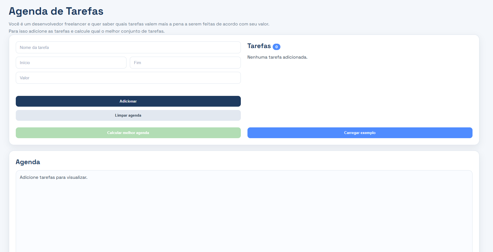
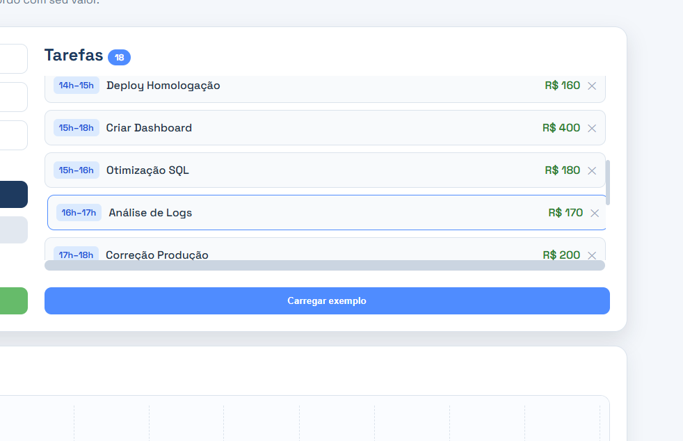
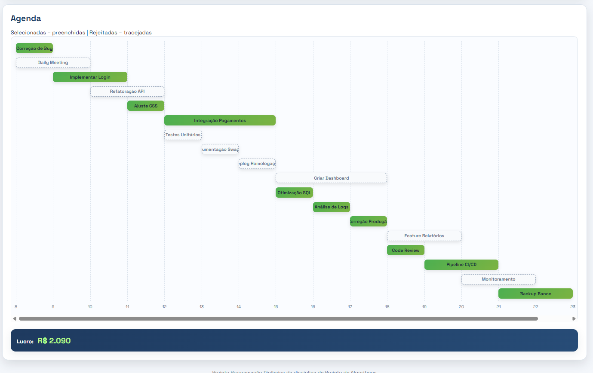

# Gerenciador de tarefas 

Número da Lista: 42 
Conteúdo da Disciplina: programação dinamica  

## Alunos
|Matrícula | Aluno |
| -- | -- |
| 242004706  |  Gabriel Vieira Octacilio Pinheiro |
| 242015989  |  Zayra Batista Moraes |

## Sobre 
Projeto G42:Imagine que você é um desenvolvedor freelancer e recebe várias propostas de serviço.

Cada proposta possui:

Nome do projeto
Horário de início
Horário de término
Valor pago

Como você só pode trabalhar em um projeto por vez, o sistema deve encontrar a combinação de projetos que gera o maior lucro possível.

Esse é exatamente o problema de Weighted Interval Scheduling ().

**Funcionalidades:**
-Interval Scheduling com Peso -  (`algoritmo.py`): Responsável por calcular a distancia entre dois pontos e retornar os dois mais proximos 
- `index.js` responsavel por funcionalidades de interface com o usuario 

## Screenshots

Tela principal mostrando mapa e layout do sistema

imagem de tarefas adicionadas

Resultado do algoritmo selecionando as tarefas que daroa mais lucro

## Instalação 
**Linguagem:** Python 3.10+  
**Framework:** `flask` `flask-cors` 

1. Clone o repositório.
2. Instale dependências:  

   ``pip install -r requirements.txt``

## Uso 

entre na pasta`/G42_Dividir-e-conquistar/backend`
rode `pip install -r requirements.txt`
rode `python app.py`
abra o arquivo html no navegador.

## Vídeo apresentação

O vídeo de apresentação pode ser acessado clicando no link abaixo.

[Apresentação](https://youtu.be/tZvYDn_WVXE)

